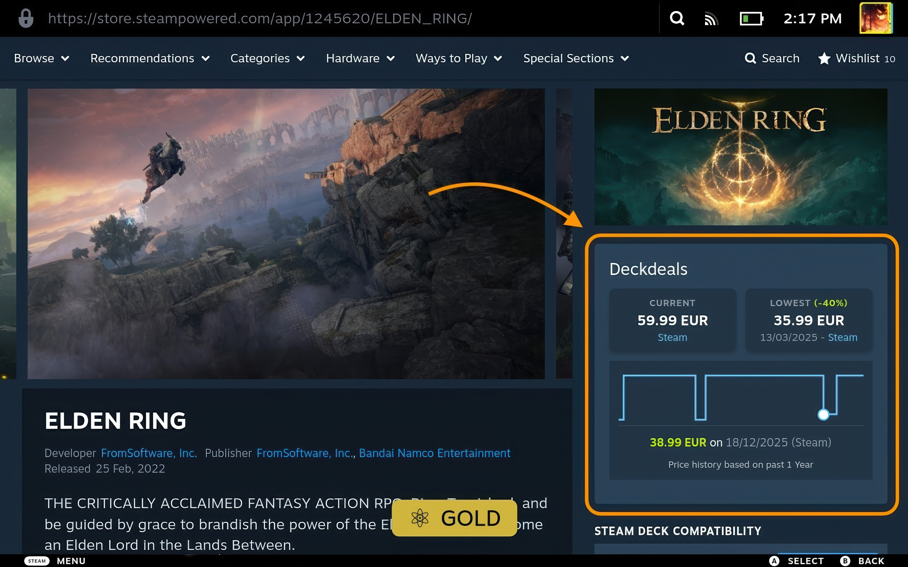

# Deckdeals
### Price History & Deals (BETA)

**Track prices, spot deals, and save money directly from the Steam Store.**
Powered by IsThereAnyDeal.

  

---

> [!NOTE]
> This is a **BETA** build. Features and UI are subject to change. I'm hoping to submit this to Decky shortly after I've had time to polish it to the fullest.

## Installation

You can install the plugin manually via the ZIP file:

1. Download the [Deckdeals-1.0.0.zip](https://github.com/draftdev-plex/deckdeals/releases/download/v1.0.0/Deckdeals-1.0.0.zip) (or fork the repo and zip it yourself).
2. On your Steam Deck, go to **Decky Options**.
3. Enable **Developer Mode** (via the General tab).
4. Go to the **Developer Tab**.
5. Select **Install Plugin from ZIP File** and choose the downloaded file.

## Features

- **Current Price**: Displays the current best price from IsThereAnyDeal across configured stores.
- **Historic Lows**: Shows the lowest price in the past 365 days for comparison.
- **Interactive Graphs**: Displays a price history graph directly on the store page.
- **Region Support**: Supports regional currency conversion based on settings.
- **Store Selection**: Configurable list of stores to track (Steam, Epic, GOG, etc.).
- **Quick Links**: Direct links to the SteamDB and IsThereAnyDeal page for the game.

## Roadmap & Planned Features

- [ ] Support for more price data providers (SteamDB, etc.).
- [ ] Additional languages and localizations.
- [ ] Wishlist compatibility and notifications.
- [ ] Ability to move the info box to different locations on the store page.

## Contributing

Contributions of translations and new additions are very welcome!

1. Copy `src/l10n/template.ts` → `src/l10n/<lang>.ts` (e.g. `de.ts`).
2. Fill in all translated strings in the template.
3. Import your file in `src/l10n/index.ts` and add it to the `locales` map.
4. Submit a pull request.

---

Made possible with the <a href="https://github.com/IsThereAnyDeal/AugmentedSteam/wiki/ITAD-API">ITAD API</a> and based on the <a href="https://github.com/JtdeGraaf/IsThereAnyDeal-DeckyPlugin">IsThereAnyDeal Decky Plugin</a> by JtdeGraaf

